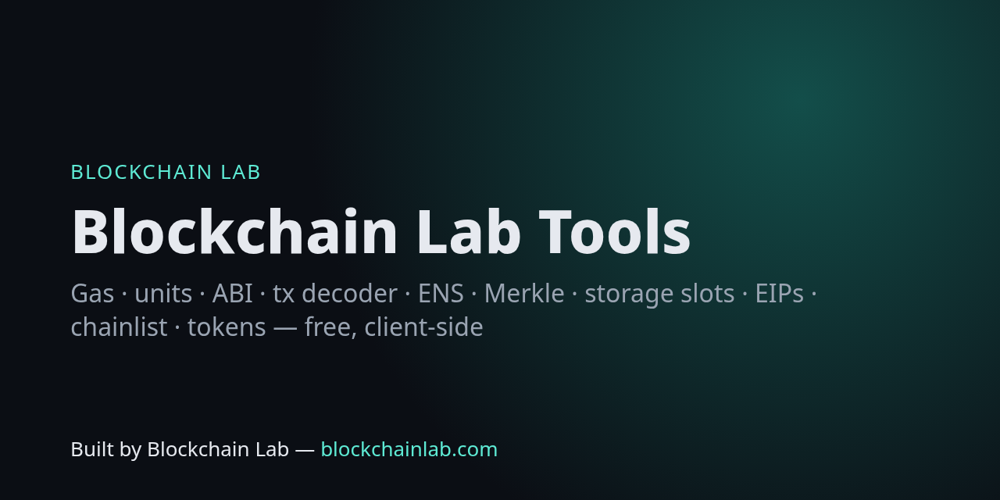

# Blockchain Lab Tools



**26 free, open-source blockchain developer tools that run 100% in your browser** against live public RPCs and APIs. No backend, no accounts, no tracking.

**Live:** https://blockchains.github.io/blockchainlab-tools/

> Built by **Blockchain Lab — [blockchainlab.com](https://blockchainlab.com/?utm_source=github&utm_medium=readme&utm_campaign=blockchainlab-tools)**

### New in v2 (Oct 2026): security, wallets & multichain

| Tool | What it does |
|---|---|
| [Safe multisig tx builder & decoder](https://blockchains.github.io/blockchainlab-tools/safe/) | Build a Safe transaction and compute its EIP-712 safeTxHash locally, cross-check against the Safe contract on-chain, read owners/threshold/nonce, and decode execTransaction or MultiSend batches. |
| [EIP-712 signer / verifier](https://blockchains.github.io/blockchainlab-tools/eip712/) | Hash EIP-712 typed data (digest, domain separator, struct hash), sign with a throwaway key or your wallet, recover the signer, verify personal_sign messages and check ERC-1271 smart-account signatures on-chain. |
| [Calldata diff](https://blockchains.github.io/blockchainlab-tools/calldiff/) | Decode two calldata blobs (or two tx hashes) with openchain/4byte signatures and highlight every argument and 32-byte word that differs. |
| [Contract verification lookup](https://blockchains.github.io/blockchainlab-tools/verify/) | Check whether a smart contract's source code is verified on Sourcify (full/partial match) and Blockscout, with compiler version, licence, proxy type and implementation addresses. |
| [Gas history charts](https://blockchains.github.io/blockchainlab-tools/gas-history/) | Chart base fee, median priority tip and block fullness over the last 1,024 blocks for Ethereum, Base, Arbitrum, OP, Polygon, BNB Chain and Avalanche, with min/median/p75/max stats. |
| [Bridge fee compare](https://blockchains.github.io/blockchainlab-tools/bridge/) | Compare live quotes for bridging USDC or ETH between Ethereum, Base, Arbitrum, OP and Polygon: amount received, fees and estimated time from Across, LI.FI and Relay. |
| [Token approval checker](https://blockchains.github.io/blockchainlab-tools/approvals/) | Check which popular spenders (Permit2, Uniswap, 1inch, 0x, CoW, Balancer, OpenSea, Aave…) can move an address's ERC-20 tokens, flag unlimited approvals, and get one-click revoke links and approve(spender, 0) calldata. |
| [ENS bulk resolver](https://blockchains.github.io/blockchainlab-tools/ens-bulk/) | Resolve a list of ENS names to addresses (with avatar, url, Twitter, GitHub records) and reverse-resolve addresses to primary names, verifying forward/reverse match. Export as CSV. |
| [Solana tx decoder](https://blockchains.github.io/blockchainlab-tools/solana-tx/) | Decode any Solana transaction signature: status, fee, compute units, parsed instructions and inner instructions with program names (Jupiter, Raydium, Orca, Meteora, SPL Token…), SOL and token balance changes, and logs. |
| [Bitcoin PSBT decoder](https://blockchains.github.io/blockchainlab-tools/psbt/) | Decode a Bitcoin PSBT (BIP-174, base64 or hex) or raw transaction: inputs, outputs, addresses, script types, fee and fee rate, signatures present, BIP-32 derivation paths. Runs offline in your browser. |
| [Address labels](https://blockchains.github.io/blockchainlab-tools/labels/) | Look up public labels for an EVM address: Blockscout contract name and public tags, token info, ENS primary name, Uniswap token-list match, well-known spender names, and an OFAC SDN sanctions check. |
| [Vanity address estimator](https://blockchains.github.io/blockchainlab-tools/vanity/) | Estimate how many attempts and how long it takes to find an Ethereum vanity address prefix (case-insensitive or EIP-55 checksum), benchmarked live on your device, and compute CREATE2 deployment addresses. |
| [Uniswap price impact](https://blockchains.github.io/blockchainlab-tools/price-impact/) | Quote a Uniswap v3 swap on-chain with QuoterV2 and see amount out, mid price, execution price, price impact, price after the trade, ticks crossed and gas estimate — Ethereum, Base, Arbitrum, OP, Polygon. |
| [MEV sandwich checker](https://blockchains.github.io/blockchainlab-tools/mev/) | Paste an Ethereum/Base/Arbitrum/OP/Polygon transaction hash to check whether it was sandwiched: finds a front-run swap on the same pool in the same direction and a back-run reversing it from the same EOA or bot contract. |
| [Stablecoin monitor](https://blockchains.github.io/blockchainlab-tools/stablecoins/) | Live stablecoin table: price vs peg, circulating supply, 7-day supply change, peg mechanism and chain count for 400+ stablecoins from DefiLlama. |
| [RPC health checker](https://blockchains.github.io/blockchainlab-tools/rpc-health/) | Test free public RPC endpoints for Ethereum, Base, Arbitrum, OP, Polygon, BNB Chain and Avalanche from your browser: reachability, latency, chain ID and how many blocks behind the best endpoint each is. Plus the nightly server-side probe. |

### Core developer tools

| Tool | What it does |
|---|---|
| [Gas & fee estimator](https://blockchains.github.io/blockchainlab-tools/gas/) | Live base fee / priority tips (eth_feeHistory) on Ethereum, Base, Arbitrum, OP, Polygon, BNB, Avalanche + Bitcoin sat/vB + Solana priority fees, with USD cost |
| [Unit converter](https://blockchains.github.io/blockchainlab-tools/units/) | wei/gwei/ether, sats/BTC, lamports/SOL with exact BigInt maths |
| [ABI encoder/decoder](https://blockchains.github.io/blockchainlab-tools/abi/) | Encode calls, decode calldata, selectors/topics, unknown-selector lookup (openchain + 4byte) |
| [Address & ENS](https://blockchains.github.io/blockchainlab-tools/address/) | EIP-55 checksum, ENS forward/reverse, balance, nonce, contract detection, EIP-1967/zeppelinos proxy implementation, EIP-7702 delegation, ERC-20 metadata |
| [Transaction decoder](https://blockchains.github.io/blockchainlab-tools/tx/) | Status, fees, L1 data fee, decoded function + args and event logs for any tx hash on 7 EVM chains |
| [Hash & Merkle](https://blockchains.github.io/blockchainlab-tools/hash/) | keccak256/sha256/ripemd160; OpenZeppelin StandardMerkleTree / SimpleMerkleTree roots + proofs |
| [Storage slots](https://blockchains.github.io/blockchainlab-tools/storage/) | Mapping / nested mapping / dynamic array / ERC-7201 / EIP-1967 slots, then read the live value |
| [EIP/ERC/BIP reference](https://blockchains.github.io/blockchainlab-tools/reference/) | Search every EIP, ERC and BIP (rebuilt nightly from the official repos) |
| [Chainlist](https://blockchains.github.io/blockchainlab-tools/chains/) | 2,700+ EVM chains from chainid.network, live RPC latency test, add-to-wallet |
| [Token lookup](https://blockchains.github.io/blockchainlab-tools/tokens/) | Uniswap default token list search + on-chain verification |

- `…/safe/?chain=ethereum&safe=0x…` · `…/verify/?chain=base&address=0x…` · `…/approvals/?address=vitalik.eth` · `…/mev/?chain=ethereum&hash=0x…` · `…/solana-tx/?sig=…` · `…/labels/?address=0x…`

### Deep links (used by [blockchainlab-lens](https://github.com/Blockchains/blockchainlab-lens) and the [MCP server](https://github.com/Blockchains/blockchainlab-mcp))

- `https://blockchains.github.io/blockchainlab-tools/tx/?chain=base&hash=0x…`
- `https://blockchains.github.io/blockchainlab-tools/address/?q=vitalik.eth&chain=ethereum`
- `https://blockchains.github.io/blockchainlab-tools/abi/?data=0xa9059cbb…`
- `https://blockchains.github.io/blockchainlab-tools/units/?v=1.5&u=ether` · `https://blockchains.github.io/blockchainlab-tools/reference/?q=4337` · `https://blockchains.github.io/blockchainlab-tools/chains/?q=8453`

## Data sources (all public, all live)

| Source | Used for |
|---|---|
| [PublicNode](https://www.publicnode.com/) RPCs (+ mainnet.base.org, arb1.arbitrum.io fallbacks) | gas, tx, address, storage, ERC-20 reads |
| [mempool.space API](https://mempool.space/docs/api/rest) | Bitcoin fee rates |
| Solana RPC `getRecentPrioritizationFees` | Solana priority fees |
| [DefiLlama coins API](https://defillama.com/docs/api) | USD prices |
| [openchain.xyz](https://openchain.xyz/signatures) / [4byte.directory](https://www.4byte.directory/) | function / event signatures |
| [Blockchain Lab Open Data API](https://blockchains.github.io/blockchainlab-api/) | chains (chainid.network), EIPs/ERCs/BIPs |
| [Uniswap token list](https://tokens.uniswap.org) | token lookup |

Caveats: L2 gas figures are execution fees only (rollups add an L1 data fee, shown per-tx in the decoder when the receipt reports it). Public RPCs are pruned — very old Ethereum history (pre-block ~15.5M) may be unavailable.

## Tests

Everything is tested against **live** networks — no mocks:

```bash
npm install && npm test          # Node: units, ABI, ENS, fees on 7 chains, real tx decoding, Merkle/ERC-7201 vectors, USDC storage slot == balanceOf
pip install playwright && python3 test/e2e.py   # headless Chrome against the live Pages site, every tool
```

What the suites check:

- `npm test` runs `test/core.test.mjs` (pack 1) and `test/core2.test.mjs` (pack 2, 16 groups): Safe hash computed locally == the Safe's own `getTransactionHash()` on a Safe freshly discovered from factory logs; EIP-712 spec "Mail" digest + signer vector; Sourcify/Blockscout verification of USDC; 1,024-block fee history; live Across/LI.FI/Relay quotes; Permit2 allowance via Multicall3 == direct `allowance()`; ENS bulk; a live Jupiter Solana tx; the official BIP-174 PSBT vector + a self-built, signed P2WPKH tx; OFAC-list hit; EIP-1014 CREATE2 vector; Uniswap v3 QuoterV2 vs `slot0`; a real jaredfromsubway sandwich (block 26119673); DefiLlama stablecoins; public RPC health.
- `python3 test/e2e.py [base]` drives every page in headless Chrome (27 checks) — run daily in CI against the live Pages site.

CI runs both on every push and daily ([live-tests.yml](.github/workflows/live-tests.yml)).

## Develop

Plain HTML + ES modules, ethers v6 and @openzeppelin/merkle-tree via import map (CDN). `python3 gen_pages.py` regenerates the tool pages; shared logic lives in [`assets/core.js`](assets/core.js).

## Related

[Open Data API](https://github.com/Blockchains/blockchainlab-api) · [MCP server](https://github.com/Blockchains/blockchainlab-mcp) · [Lens](https://github.com/Blockchains/blockchainlab-lens) · [Labs](https://github.com/Blockchains/blockchainlab-labs) · [Roadmap](https://github.com/Blockchains/blockchain-dev-roadmap) · [Interview questions](https://github.com/Blockchains/blockchain-interview-questions) · [Whitepaper library](https://blockchainlab.com/whitepaper?utm_source=github&utm_medium=readme&utm_campaign=blockchainlab-tools)

MIT licensed. Not financial advice.

## Configuration

None. Every tool runs in the browser against public RPCs and public APIs; no keys, no backend.

## Contributing

Issues and pull requests are welcome. Please read the [contributing guide](https://github.com/Blockchains/.github/blob/main/CONTRIBUTING.md), [code of conduct](https://github.com/Blockchains/.github/blob/main/CODE_OF_CONDUCT.md) and [security policy](https://github.com/Blockchains/.github/blob/main/SECURITY.md) first.

---
Built by Blockchain Lab — [blockchainlab.com](https://blockchainlab.com/?utm_source=github&utm_medium=readme&utm_campaign=blockchainlab-tools)
